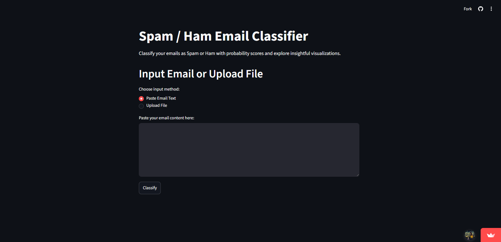

# SpamShield

<p align="center">
  <br/>
</p>

📧 *SpamShield* is an intelligent email classification system that detects *spam* and *ham* messages using *Machine Learning* and *Natural Language Processing (NLP)*. It provides probability scores for spam/ham, highlights top contributing keywords, and visualizes historical classification insights.

Live Demo: [https://spamshields.streamlit.app/](https://spamshields.streamlit.app/)

---

## Features

- *Spam / Ham Classification* – Classifies emails in real-time
- *Probability Scores* – Shows confidence for both Spam and Ham
- *Keyword Insights* – Displays top contributing words influencing the prediction
- *Batch Upload* – Classify multiple emails via CSV upload
- *History Tracking* – Keeps a log of classified emails with timestamps
- *Visual Insights* – Pie charts, probability trends, and bar charts for easy analysis
- *Download History* – Export classification history as CSV

---

## Installation

1. Clone the repository:
bash
git clone https://github.com/yourusername/SpamShield.git
cd SpamShield


2. Install dependencies:
bash
pip install -r requirements.txt


3. Run the Streamlit app:
bash
streamlit run streamlitapp/app.py


---

## Usage

1. Open the app in your browser (default: http://localhost:8501)
2. *Paste Email Text* or *Upload CSV* containing emails
3. Click *"Classify"* to view spam/ham predictions, probabilities, and top keywords
4. Scroll down to see *historical trends* and visual insights
5. Download your *history as CSV* if needed

---

## Model & Features

- *Classifier:* Support Vector Machine (SVM) with probability scores
- *Text Features:*
  - Cleaned email text
  - Word frequencies / TF-IDF
- *Numeric Features:*
  - Email length
  - Number of links
  - Uppercase letters count
  - Special characters count

---

## Project Structure

```

SpamShield/
│
├── data/
├── notebooks/
├── src/
│   ├── __init__.py
│   ├── features.py
│   ├── train.py
│   ├── utils.py
│   └── validation.py
├── streamlitapp/
│   └── app.py
├── tests/
├── MalidataModel/
│   ├── svm_spam_model_optimized.pkl
│   ├── tfidf_vectorizer_optimized.pkl
│   ├── appStreamlit.py
│   └── model.ipynb
├── requirements.txt
├── Dockerfile
└── README.md

```

---

## Live Demo

Try SpamShield online: [https://spamshields.streamlit.app/](https://spamshields.streamlit.app/)

---

## License

This project is licensed under the MIT License.

## Authors

Made by Team ActiveNation
